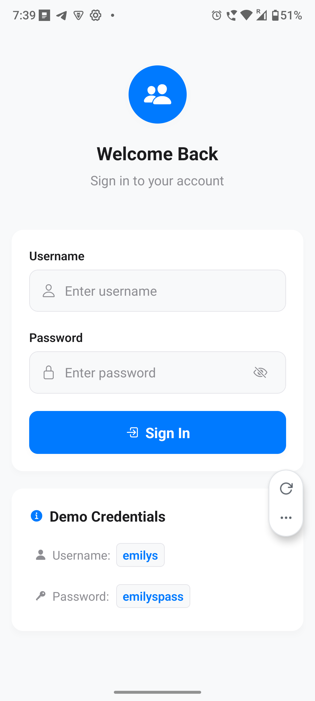
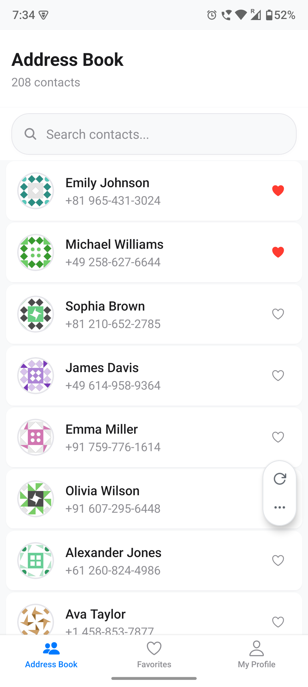
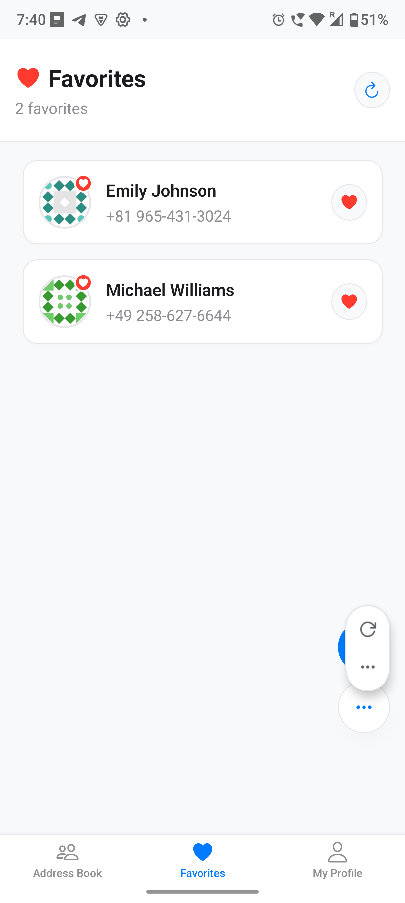
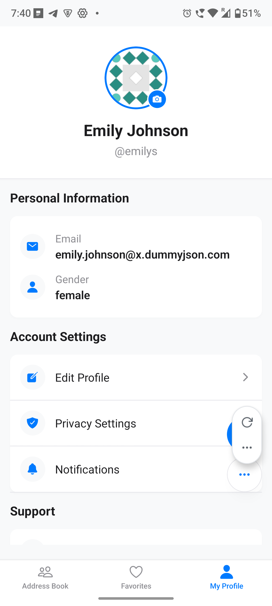

## PhoneBookApp

A modern, minimal Contacts app built with Expo + React Native. It supports authentication, browsing and searching users, viewing details, managing favorites, and a simple profile view. The UI follows clean, card-based layouts with consistent spacing, meaningful icons, and subtle shadows.

### App Preview

<p align="center">
  
  
  
  
  
</p>

### Tech Stack

- React Native (Expo)
- TypeScript
- Redux Toolkit (state management)
- Axios (API + interceptors)
- AsyncStorage (token and small data persistence)
- React Navigation (native-stack + bottom-tabs)

### Features

- Secure login with DummyJSON auth
- Address Book with search, infinite scroll, and pull-to-refresh
- Favorites list with quick refresh actions
- Contact Detail view (no extra API call; uses previously fetched data)
- Profile screen with avatar fallback and logout
- Centralized constants for colors, spacing, typography, routes, and API endpoints

### Getting Started

1. Install dependencies

```bash
npm install
```

2. Start the app (development)

```bash
npm run start
# or
npm run android
npm run ios
npm run web
```

Expo will open the dev tools. Use Expo Go or an emulator/simulator to run the app.

### Demo Credentials

- Username: `emilys`
- Password: `emilyspass`

### Project Structure

```text
PhoneBookApp/
  App.tsx                    # App entry (providers + navigator)
  index.ts                  # Expo root registration
  src/
    components/            # UI components (cards, etc.)
    constants/             # COLORS, TYPOGRAPHY, SPACING, ROUTES, API
    navigation/            # AppNavigator (tabs + stack)
    screens/               # Screens (Login, AddressBook, Favorites, Profile, Detail)
    services/              # Axios instance + API modules
    store/                 # Redux store + slices (auth, users, favorites)
    types/                 # Shared TypeScript types
```

### Key Concepts

- Authentication

  - Login: `POST /auth/login` (DummyJSON)
  - Tokens stored in AsyncStorage under:
    - `access_token`, `refresh_token`, `user_data`
  - On app start, auth initializes and hydrates profile; a loader shows to avoid flashing the login screen.

- Users

  - List: `GET /users?skip=<n>&limit=<n>`
  - Search: `GET /users/search?q=<query>&skip=<n>&limit=<n>`
  - Address Book integrates search with debounce and infinite scroll.
  - Detail screen receives the selected `User` object from navigation params (no additional fetch by design).

- Favorites
  - Stored as an array of user IDs in AsyncStorage under `favorites`.
  - Add/remove favorites via slice thunks; Favorites screen filters the cached users list.

### Navigation

Centralized route names in `src/constants/index.ts` under `ROUTES`:

```ts
export const ROUTES = {
  MAIN_TABS: "MainTabs",
  ADDRESS_BOOK: "AddressBook",
  FAVORITES: "Favorites",
  PROFILE: "Profile",
  CONTACT_DETAIL: "ContactDetail",
} as const;
```

Use these across the app for strong consistency and to avoid hardcoded strings.

### Styling

Color palette, spacing, and typography are centralized in `src/constants/index.ts` as `COLORS`, `SPACING`, and `TYPOGRAPHY`. Import and reuse these tokens in screens and components for consistency.

### API & Interceptors

- `src/services/api.ts` defines a shared Axios instance.
- Request interceptor attaches `Authorization: Bearer <access_token>` if present.
- Response interceptor handles unauthorized responses by clearing stored tokens.

### State Management

- `src/store/` uses Redux Toolkit.
  - `authSlice`: login, getProfile (hydrate from storage), logout
  - `usersSlice`: fetch, search, and load-more users
  - `favoritesSlice`: load, add, remove favorites (persisted in storage)

### UX Notes

- Login errors show via subtle visual cues (red input borders + shake) rather than intrusive alerts.
- Avatar fallback displays the initials if the image is empty/invalid.
- Lists use stable composite keys to prevent duplicate-key warnings.

### Troubleshooting

- Duplicate key warning in lists
  - Ensure `keyExtractor` produces unique keys (composite of `id-index` is used).
- Stuck on login screen at cold start
  - The navigator shows a loader during auth initialization to prevent flashing. If it persists, clear app storage and retry.
- Network errors
  - Confirm connectivity and DummyJSON availability.

### License

This project is for educational/demo purposes.
